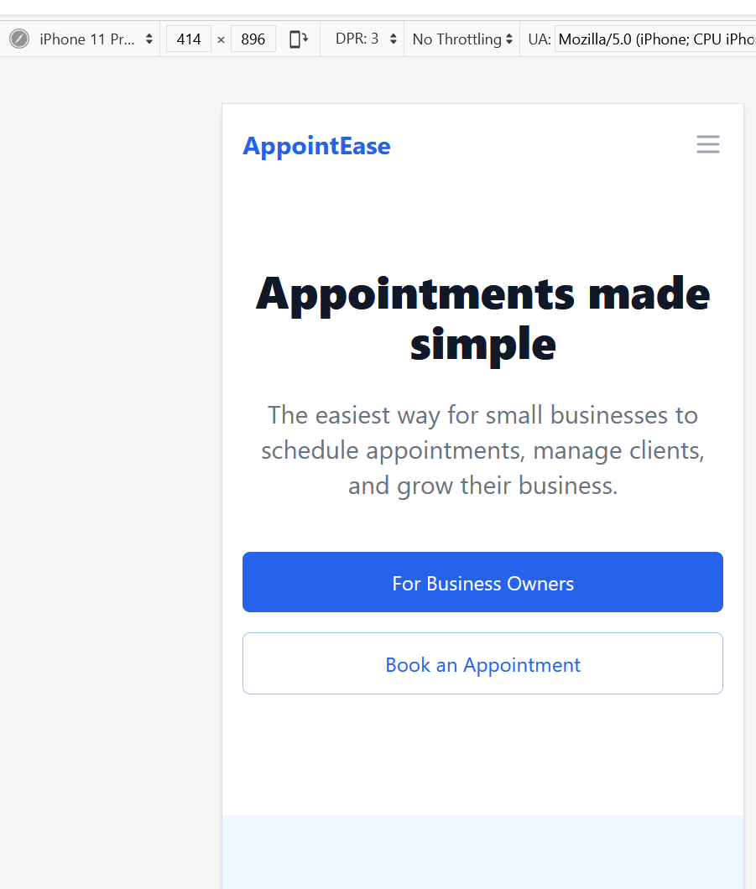

## Document Your Process:

1. **Your experience using AI for planning:** - list opportunities and challenges

- **Opportunities:**
  - Enhanced creativity and brainstorming
  - Efficient problem-solving
  - Tailored solutions for specific needs
  - Time-saving in research and development
  - Scalability for larger projects
  - Accessibility for diverse users
  - Cost-effective solutions
  - Learning enhancement through AI-generated insights
  - Complex problem-solving capabilities
  - Improved communication and collaboration
  - Automation of repetitive tasks

- **Challenges:**
- Debugging generated sources
- Integrating AI outputs into existing workflows
- Blind prompting leading to unexpected results
- Ensuring ethical use of AI-generated content
- Managing data privacy and security concerns
- Balancing human input with AI-generated suggestions
- Overcoming biases in AI-generated content
- Maintaining quality control in AI outputs
- Adapting to rapidly evolving AI technologies
- Ensuring user-friendly interfaces for non-technical users
- Addressing potential job displacement concerns

2. **Effective prompts you discovered:** list the 5 principles of effective prompt engineering
##### The Five principles of Effective Prompting are:
1. **Give Direction:** provide a clear direction by describing the desired style in detail ( be descriptive) or reference a relevant persona.
2. **Specify Format:** define what **rules** to follow, and the required **structure** of the response.
3. **Provide Examples:** provide diverse set of use cases or examples where the task was one correctly.
4. **Evaluate Quality:** identity errors on the responses, rate responses, testing what drives performance.
5. **Divide Labor:** split tasks into multiple steps, solve each segment in isolation and finally put together the solutions into one that solve complex big problem.

3. **Challenges you faced and how you overcame them:** debugging generated sources, putting everything together, blind prompting, 
   1. Integrating AI outputs into existing workflows
   2. Blind prompting leading to unexpected results
   3. Ensuring ethical use of AI-generated content
   4. Customizing pages to meet specific ne

## 4. **Screenshots of your completed front-End:** starting with landing page, management portal, & main pages, and service management page. 
### 1. Landing page:

### 2. Business Dashboard:

### 3. Book an Appointment: 

### 4. Sign up options

### 5. Sign up as a Customer or Client

### 6. Sign up as a Business Owner

### 7. Professional Login page:

### 8. Testing responsiveness: Desktop/Web browsers, Tables & Mobiles
#### Mobile view:

#### Tablet view:

#### Responsiveness Testing of the Landing Page UI:

## 5. **What you learned about prompt engineering?:** 
		1. Optimizing AI outputs
		2. Enhanced Creativity
		3. Efficiency in Communication
		4. Tailored solutions
		5. Time-Saving
		6. Complex Problem solving
		7. Accessibility
		8. Cost Effectiveness
		9. Learning Enhancement
		10. Scalability
