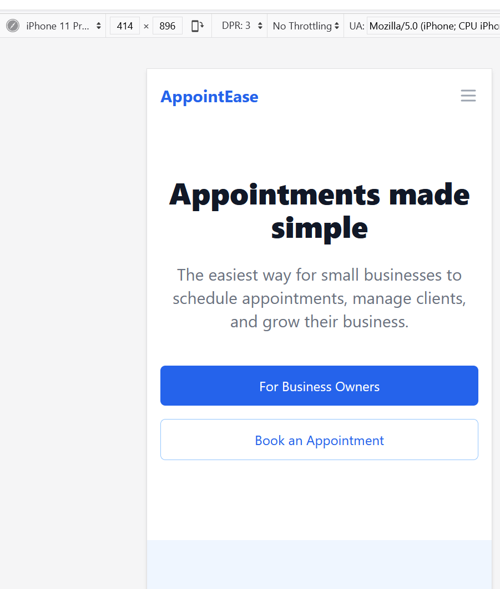

## Appointment Scheduler Project Planning Version 1 

```
I'm building a small business appointment scheduler for local entrepreneurs like barbers, stylists, consultants, or tutors. Please help me plan this application with the following:

1. Key features needed for a minimum viable product (MVP)
2. User stories for both business owners and clients
3. A simple data model for storing:
   - Business information
   - Service offerings
   - Appointments
   - Clients
4. Basic workflow for how the application should function
5. Technical considerations for a frontend using HTML, Alpine.js, and TailwindCSS
6. Technical considerations for a backend using Python and Supabase

My technical knowledge is beginner-intermediate level with some understanding of Python, HTML, and basic database concepts.
```

# Small Business Appointment Scheduler Planning
I'll help you plan your appointment scheduler application for local entrepreneurs. This is a practical project with a clear purpose that can provide real value to small business owners.
## 1. Key Features for MVP
- **User Authentication:** Separate login for business owners and clients
- **Business Profile Management:** Basic information about the business
- **Service Management:** Adding, editing, and removing service offerings
- **Appointment Scheduling:** Calendar view for availability and booking
- **Client Management:** Basic client information and booking history
- **Notifications:** Email confirmations and reminders for appointments
- **Simple Admin Dashboard:** For business owners to view upcoming appointments
- **Mobile-Responsive Design:** Works well on both desktop and mobile devices

## 2. User Stories
### Business Owner Stories
- As a business owner, I want to create my business profile so clients can find my services
- As a business owner, I want to define my services with prices and duration so clients know what I offer
- As a business owner, I want to set my availability hours so clients can only book when I'm available
- As a business owner, I want to view all upcoming appointments so I can plan my day
- As a business owner, I want to receive notifications when new appointments are booked
- As a business owner, I want to cancel or reschedule appointments when necessary
- As a business owner, I want to view client booking history to better understand my customers

### Client Stories
- As a client, I want to browse available services so I can decide what to book
- As a client, I want to see available time slots so I can book at a convenient time
- As a client, I want to create an account to manage my appointments
- As a client, I want to receive confirmation and reminders about my appointments
- As a client, I want to cancel or reschedule my appointment if needed
- As a client, I want to view my booking history for reference
- As a client, I want to leave feedback after my appointment


## Simple Data Models:
1. Business
2. Services
3. Users
4. clients
5. Appointments

###  1. Business Model
- business_id (PK)
- name
- description
- contact_email
- contact_phone
- address
- business_hours (JSON format for each day)
- logo_url
- owner_user_id (FK to Users)

### 2. Services Model
- service_id (PK)
- business_id (FK to Business)
- name
- description
- price
- duration_minutes
- is_active

### 3. Users Model
- user_id (PK)
- email
- password_hash
- first_name
- last_name
- phone
- user_type (business_owner or client)
- created_at

### 4. Clients Model
- client_id (PK)
- user_id (FK to Users)
- notes (for business owner use)
- preferred_contact (email/phone)

### 5. Appointments Model

- appointment_id (PK)
- service_id (FK to Services)
- client_id (FK to Clients)
- business_id (FK to Business)
- start_time
- end_time
- status (booked, completed, canceled, no-show)
- notes
- created_at
- updated_at

## 4. Basic Workflow
1. **Business Owner Onboarding:**
    - Register as a business owner
    - Create business profile
    - Add services with prices and duration
    - Set availability and business hours

2. **Client Booking Flow:**
    - Browse businesses or access a specific business link
    - Register/login as a client
    - View services offered
    - Select desired service
    - View available time slots
    - Book appointment
    - Receive confirmation

3. **Appointment Management:**
    - Both clients and business owners can view upcoming appointments
    - Either party can cancel or request rescheduling
    - Automated reminders sent before appointment
    - Business owner can mark appointments as completed
    - Optional follow-up for feedback

## 5. Frontend Technical Considerations
### HTML + Alpine.js + TailwindCSS
- **TailwindCSS Setup:**
    - Use a CDN for quick setup initially
    - Later consider using a build process with PostCSS for production
    - Utilize Tailwind's responsive utilities for mobile-first design

- **Alpine.js for Interactivity:**
    - Calendar component for date selection
    - Time slot picker with available/unavailable slots
    - Form validation for user inputs
    - Modal dialogs for confirmations and alerts
    - Tabs for organizing dashboard sections

- **Page Structure:**
    - Landing page with explanation of service
    - Business profile pages
    - Service listing pages
    - Booking form with calendar
    - User account pages (separate for clients and business owners)
    - Dashboard for business owners

- **Responsive Considerations:**
    - Ensure calendar view works well on mobile
    - Simplified navigation for small screens
    - Touch-friendly interface elements

## 6. Backend Technical Considerations
### Python + Supabase
- **Supabase Setup:**
    - Setup authentication (handles logins, signups, password resets)
    - Create database tables based on your data model
    - Set up row-level security policies to protect data
    - Configure email notifications through Supabase or a third-party service

- **Python Backend:**
    - Use a lightweight framework like FastAPI or Flask
    - Create REST API endpoints for:
        - User management
        - Business profile CRUD
        - Service CRUD
        - Appointment booking logic
        - Availability calculations

    - Implement business logic for:
        - Checking availability before booking
        - Preventing double-bookings
        - Managing appointment status changes
        - Sending notifications

- **Integration Points:**
    - Use Supabase JavaScript library on frontend for auth
    - Use Supabase Python library for backend operations
    - Consider serverless functions for scheduled tasks like reminders

- **Security Considerations:**
    - Proper authentication for all API endpoints
    - Data validation and sanitization
    - Separation of business owner vs client permissions

## Getting Started Recommendations
1. Start with setting up Supabase and your database schema
2. Create a simple frontend with the business owner flow
3. Implement the service creation functionality
4. Build the calendar view and booking logic
5. Add client registration and authentication
6. Implement notifications and reminders
7. Polish the UI/UX for both personas

## Appointment Scheduler  UI Wireframes

1. Landing Page
+--------------------------------------------------------------+
|  LOGO    Home   Features   Pricing   Sign Up   Login         |
+--------------------------------------------------------------+
|                                                              |
|    +--------------------------------------------------+      |
|    |                                                  |      |
|    |     Simple Appointment Scheduling                |      |
|    |     for Small Businesses                         |      |
|    |                                                  |      |
|    |     [Get Started - Business]  [Book Now - Client]|      |
|    |                                                  |      |
|    +--------------------------------------------------+      |
|                                                              |
+--------------------------------------------------------------+
|                                                              |
|  +-------------+    +-------------+    +-------------+       |
|  | Easy Setup  |    | Manage      |    | Happy       |       |
|  | Icon        |    | Bookings    |    | Clients     |       |
|  |             |    | Icon        |    | Icon        |       |
|  | Quick setup |    | Simple      |    | Automated   |       |
|  | for your    |    | calendar    |    | reminders   |       |
|  | business    |    | management  |    | & feedback  |       |
|  +-------------+    +-------------+    +-------------+       |
|                                                              |
+--------------------------------------------------------------+
|                                                              |
|  How It Works  |  Testimonials  |  Featured Businesses       |
|                |                |                            |
+--------------------------------------------------------------+
|  Footer: Contact | About | Terms | Privacy                   |
+--------------------------------------------------------------+


2. Business Owner Dashboard
+--------------------------------------------------------------+
|  LOGO    Dashboard   Services   Clients   Settings   Logout  |
+--------------------------------------------------------------+
|                                                              |
|  Welcome back, [Business Name]                               |
|                                                              |
|  +-------------------+  +----------------------------+       |
|  | Today's Schedule  |  | Upcoming Appointments      |       |
|  |                   |  |                            |       |
|  | 9:00 - John Smith |  | Tomorrow                   |       |
|  | Haircut           |  | • 10:00 - Jane Doe         |       |
|  |                   |  | • 14:30 - Mike Johnson     |       |
|  | 11:30 - Lisa Brown|  |                            |       |
|  | Coloring          |  | Next 7 Days: 12 bookings   |       |
|  |                   |  | [View All]                 |       |
|  | [View Full Day]   |  |                            |       |
|  +-------------------+  +----------------------------+       |
|                                                              |
|  +-------------------+  +----------------------------+       |
|  | Quick Stats       |  | Recent Activity            |       |
|  |                   |  |                            |       |
|  | Appointments:     |  | • New booking - 10min ago  |       |
|  | This week: 24     |  | • Cancellation - 1hr ago   |       |
|  | Last week: 19     |  | • Review received - 3hr ago|       |
|  |                   |  | • New client - Yesterday   |       |
|  | New clients: 5    |  |                            |       |
|  | Cancellations: 2  |  | [View All Activity]        |       |
|  +-------------------+  +----------------------------+       |
|                                                              |
+--------------------------------------------------------------+


3. Business Services Management
+--------------------------------------------------------------+
|  LOGO    Dashboard   Services   Clients   Settings   Logout  |
+--------------------------------------------------------------+
|                                                              |
|  Services Management                        [+ Add Service]  |
|                                                              |
|  +----------------------------------------------------------+|
|  | Service Name | Duration | Price | Status | Actions       ||
|  |----------------------------------------------------------||
|  | Haircut      | 30 min   | $25   | Active | Edit Delete  ||
|  |----------------------------------------------------------||
|  | Styling      | 45 min   | $40   | Active | Edit Delete  ||
|  |----------------------------------------------------------||
|  | Coloring     | 120 min  | $120  | Active | Edit Delete  ||
|  |----------------------------------------------------------||
|  | Special      | 90 min   | $80   | Hidden | Edit Delete  ||
|  | Treatment    |          |       |        |              ||
|  +----------------------------------------------------------+|
|                                                              |
|  Service Categories                       [+ Add Category]   |
|                                                              |
|  +----------------------------------------------------------+|
|  | Category     | # Services | Status   | Actions           ||
|  |----------------------------------------------------------||
|  | Hair         | 4          | Active   | Edit Delete       ||
|  |----------------------------------------------------------||
|  | Facial       | 2          | Active   | Edit Delete       ||
|  +----------------------------------------------------------+|
|                                                              |
+--------------------------------------------------------------+

4. Availability Management Screen
+--------------------------------------------------------------+
|  LOGO    Dashboard   Services   Clients   Settings   Logout  |
+--------------------------------------------------------------+
|                                                              |
|  Availability Settings                                       |
|                                                              |
|  +----------------------------------------------------------+|
|  | Business Hours                                           ||
|  |----------------------------------------------------------||
|  | Monday    | [x] 9:00 AM - 5:00 PM  | [+ Add Hours]      ||
|  | Tuesday   | [x] 9:00 AM - 5:00 PM  | [+ Add Hours]      ||
|  | Wednesday | [x] 9:00 AM - 5:00 PM  | [+ Add Hours]      ||
|  | Thursday  | [x] 9:00 AM - 7:00 PM  | [+ Add Hours]      ||
|  | Friday    | [x] 9:00 AM - 7:00 PM  | [+ Add Hours]      ||
|  | Saturday  | [x] 10:00 AM - 4:00 PM | [+ Add Hours]      ||
|  | Sunday    | [ ] Closed             | [+ Add Hours]      ||
|  +----------------------------------------------------------+|
|                                                              |
|  +----------------------------------------------------------+|
|  | Special Closures & Time Off                [+ Add Date]  ||
|  |----------------------------------------------------------||
|  | July 4, 2023           | Holiday          | Delete       ||
|  | August 15-20, 2023     | Vacation         | Delete       ||
|  +----------------------------------------------------------+|
|                                                              |
|  Appointment Settings                                        |
|  +----------------------------------------------------------+|
|  | Minimum notice for booking: [dropdown: 2 hours]          ||
|  | Buffer time between appointments: [dropdown: 15 minutes] ||
|  | Allow clients to book up to: [dropdown: 60 days ahead]   ||
|  +----------------------------------------------------------+|
|                                                              |
|  [Save Changes]                                              |
+--------------------------------------------------------------+

5. Client-Facing Booking page
+--------------------------------------------------------------+
|  LOGO    Services   About   Contact         Login  Sign Up   |
+--------------------------------------------------------------+
|                                                              |
|  [Business Name]                                             |
|  Book Your Appointment                                       |
|                                                              |
|  +---------------------+  +----------------------------+     |
|  | 1. Select Service   |  |        July 2023           |     |
|  |                     |  |  Mo Tu We Th Fr Sa Su      |     |
|  | • Haircut ($25)     |  |   1  2  3  4  5  6  7      |     |
|  |   30 minutes        |  |   8  9 10 11 12 13 14      |     |
|  |                     |  |  15 16 17 18 19 20 21      |     |
|  | • Styling ($40)     |  |  22 23 24 25 26 27 28      |     |
|  |   45 minutes        |  |  29 30 31                  |     |
|  |                     |  |                            |     |
|  | • Coloring ($120)   |  |  Available dates are       |     |
|  |   120 minutes       |  |  highlighted               |     |
|  |                     |  +----------------------------+     |
|  | • Special ($80)     |                                     |
|  |   Treatment         |  +----------------------------+     |
|  |   90 minutes        |  | 3. Available Time Slots    |     |
|  |                     |  | for July 15, 2023          |     |
|  +---------------------+  |                            |     |
|                           | • 9:00 AM                  |     |
|  +---------------------+  | • 10:00 AM                 |     |
|  | 2. Select Staff     |  | • 11:30 AM                 |     |
|  | (if applicable)     |  | • 2:15 PM                  |     |
|  |                     |  | • 3:30 PM                  |     |
|  | • Any Available     |  |                            |     |
|  | • John (Stylist)    |  |                            |     |
|  | • Mary (Colorist)   |  |                            |     |
|  +---------------------+  +----------------------------+     |
|                                                              |
|  [Continue to Checkout]                                      |
+--------------------------------------------------------------+


6. Appointment Confirmation and Client Details
+--------------------------------------------------------------+
|  LOGO    Services   About   Contact         Login  Sign Up   |
+--------------------------------------------------------------+
|                                                              |
|  Confirm Your Booking                                        |
|                                                              |
|  +----------------------------------------------------------+|
|  | Booking Summary                                          ||
|  |----------------------------------------------------------||
|  | Service:    | Haircut                                    ||
|  | Date:       | July 15, 2023                              ||
|  | Time:       | 10:00 AM                                   ||
|  | Duration:   | 30 minutes                                 ||
|  | Provider:   | John                                       ||
|  | Price:      | $25                                        ||
|  +----------------------------------------------------------+|
|                                                              |
|  +----------------------------------------------------------+|
|  | Your Information                                         ||
|  |----------------------------------------------------------||
|  | First Name: | [____________]                             ||
|  | Last Name:  | [____________]                             ||
|  | Email:      | [____________]                             ||
|  | Phone:      | [____________]                             ||
|  |                                                          ||
|  | [ ] Create an account to manage your appointments        ||
|  | [ ] Send me appointment reminders via email              ||
|  | [ ] Send me appointment reminders via SMS                ||
|  |                                                          ||
|  | Special requests or notes:                               ||
|  | [                                          ]             ||
|  | [                                          ]             ||
|  +----------------------------------------------------------+|
|                                                              |
|  [< Back]                              [Confirm Booking >]   |
+--------------------------------------------------------------+

7. Client Dashboard

+--------------------------------------------------------------+
|  LOGO    My Appointments   Book New   Account    Logout      |
+--------------------------------------------------------------+
|                                                              |
|  Welcome back, [Client Name]                                 |
|                                                              |
|  +----------------------------------------------------------+|
|  | Upcoming Appointments                                    ||
|  |----------------------------------------------------------||
|  | July 15, 2023 | 10:00 AM | Haircut with John            ||
|  | [Reschedule] [Cancel]                                    ||
|  |                                                          ||
|  | August 2, 2023 | 2:15 PM | Coloring with Mary           ||
|  | [Reschedule] [Cancel]                                    ||
|  +----------------------------------------------------------+|
|                                                              |
|  [+ Book New Appointment]                                    |
|                                                              |
|  +----------------------------------------------------------+|
|  | Past Appointments                                        ||
|  |----------------------------------------------------------||
|  | June 10, 2023 | Haircut with John | [Leave Review]       ||
|  | May 15, 2023  | Styling with Mary | ★★★★☆                ||
|  | April 2, 2023 | Haircut with John | ★★★★★                ||
|  |                                                          ||
|  | [View All History]                                       ||
|  +----------------------------------------------------------+|
|                                                              |
+--------------------------------------------------------------+


8. Mobile View (Business Dashboard)
+-------------------------+
| LOGO       ≡ Menu       |
+-------------------------+
|                         |
| Today's Schedule        |
|                         |
| • 9:00 - John Smith     |
|   Haircut               |
|                         |
| • 11:30 - Lisa Brown    |
|   Coloring              |
|                         |
| [View Full Day]         |
+-------------------------+
|                         |
| Quick Stats             |
|                         |
| Appts this week: 24     |
| New clients: 5          |
| Cancellations: 2        |
|                         |
+-------------------------+
|                         |
| Recent Activity         |
|                         |
| • New booking - 10m ago |
| • Cancellation - 1h ago |
|                         |
| [View All Activity]     |
+-------------------------+
|                         |
| [+ Add Quick Booking]   |
|                         |
+-------------------------+
| Dashboard | Calendar |  |
| Services  | Clients  |  |
+-------------------------+


9. Mobile View (Client Booking)
+-------------------------+
| LOGO       ≡ Menu       |
+-------------------------+
|                         |
| Book Your Appointment   |
|                         |
| Step 1 of 3: Service    |
|                         |
| Select Service:         |
|                         |
| ○ Haircut               |
|   30 minutes - $25      |
|                         |
| ○ Styling               |
|   45 minutes - $40      |
|                         |
| ○ Coloring              |
|   120 minutes - $120    |
|                         |
| ○ Special Treatment     |
|   90 minutes - $80      |
|                         |
| [Continue >]            |
+-------------------------+
|                         |
| About | Contact | Login |
+-------------------------+


### Business Dashboard
-- HTML for the business landing page.

<!DOCTYPE html>
<html lang="en">
<head>
    <meta charset="UTF-8">
    <meta name="viewport" content="width=device-width, initial-scale=1.0">
    <title>Business Dashboard - AppointEase</title>
    <!-- TailwindCSS CDN -->
    <script src="https://cdn.tailwindcss.com"></script>
    <!-- Alpine.js CDN -->
    <script defer src="https://cdn.jsdelivr.net/npm/alpinejs@3.x.x/dist/cdn.min.js"></script>
    <!-- Font Awesome -->
    <link rel="stylesheet" href="https://cdnjs.cloudflare.com/ajax/libs/font-awesome/6.4.0/css/all.min.css">
</head>


## Running the project
$ npm start
```

### http://localhost:3000 to access the appointment scheduler site





### Recommended code to be integerate with the Python backend
``
async confirmBooking() {
    try {
        const bookingData = {
            service_id: this.selectedService.id,
            date: this.selectedDate,
            time: this.selectedTime,
            client_info: {
                first_name: this.personalInfo.firstName,
                last_name: this.personalInfo.lastName,
                email: this.personalInfo.email,
                phone: this.personalInfo.phone,
                notes: this.personalInfo.notes
            },
            payment_info: {
                // In a real app, use a secure payment processor
                // Don't send full card details directly
                card_last_four: this.paymentInfo.cardNumber.slice(-4)
            }
        };
        
        const response = await fetch('/api/bookings', {
            method: 'POST',
            headers: {
                'Content-Type': 'application/json',
            },
            body: JSON.stringify(bookingData)
        });
        
        if (!response.ok) {
            throw new Error('Failed to create booking');
        }
        
        const result = await response.json();
        
        // Show confirmation
        this.bookingId = result.booking_id;
        this.currentStep = 5;
    } catch (error) {
        console.error('Error submitting booking:', error);
        alert('There was an error processing your booking. Please try again.');
    }
}


###  Prompt to create business owners dashboard
```
Based on my project specifications, create a business owner dashboard that includes the following:
1.	Financial Metrics: Revenue and Expenses, Profit Margins, Cash Flow, and Sale Trends
2.	Customer Insights: Customer Retention Rate, Customer feedback, Loyalty program Metrics
3.	Operational metrics: inventory levels, appointment scheduling, and staff performance.
4.	Marketing metrics: social media Engagement, Website Traffic, and Campaign ROI
5.	Industry-Specific Metrics: service Time, Menu or Service Popularity
6.	Alerts and Notifications: Low Inventory Alerts, Upcoming Appointments, and Payment Reminders.
This business owners’ dashboard will popup when the “For Business Owners” is clicked on landing page.


### Prompt to Generate a signup page

Based on my project specifications, create a sign-up page that allow to sign up as business owner, system administrator, or customer or client. Business on the visitor or user selection, the required information should change relevant to business owner, system admin or regular customer or client.
But in general, each register should provide the following information: 
Basic Information
•	Full Name: First and last name for identification.
•	Email Address: A valid email for communication and account verification.
•	Phone Number: Optional but useful for direct contact.
Account Details
•	Username: A unique identifier for the user.
•	Password: Ensure strong password requirements for security.
•	Confirm Password: To avoid errors during account creation.
Business Information (if applicable)
•	Company Name: For business-related CRM platforms.
•	Role/Position: Helps tailor the CRM experience.
•	Industry Type: Useful for segmentation and analytics.
Preferences and Permissions
•	Communication Preferences: Opt-in for newsletters or updates.
•	Terms and Conditions: Checkbox for agreement to policies.
•	Privacy Policy: Link to the privacy statement.
Security Features
•	Captcha or reCAPTCHA: To prevent spam or bots.
•	Two-Factor Authentication (2FA): Optional for added security.
Additional Fields (Optional)
•	Referral Code: If applicable, for tracking referrals.
•	Custom Questions: Tailored to the platform's needs.
User Experience Enhancements
•	Progress Indicator: For multi-step forms.
•	Error Messages: Clear and helpful prompts for invalid inputs.
•	Mobile-Friendly Design: Ensure compatibility with all devices.


